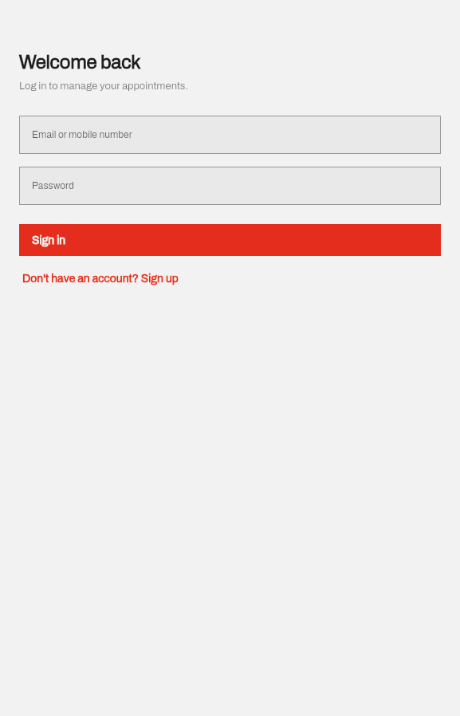
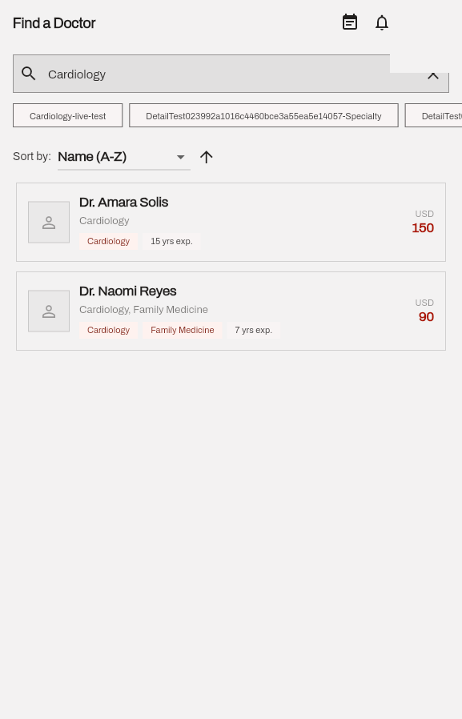
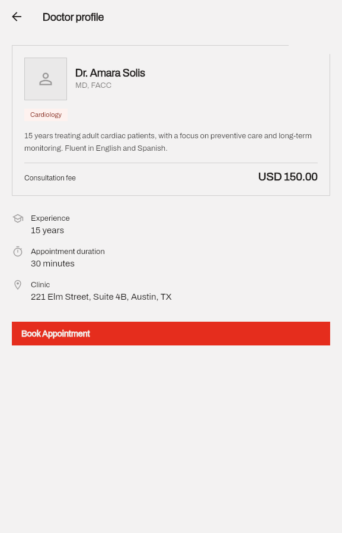
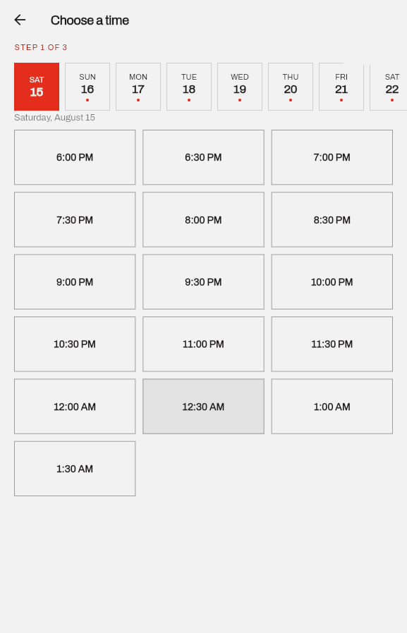
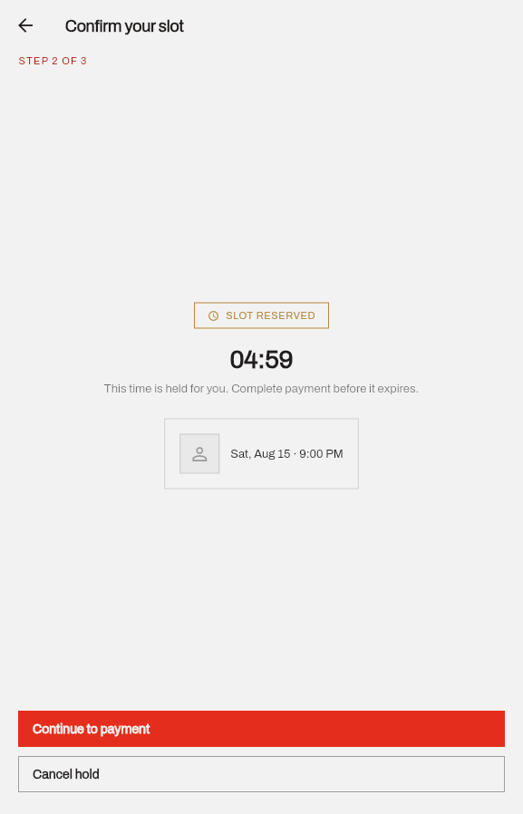
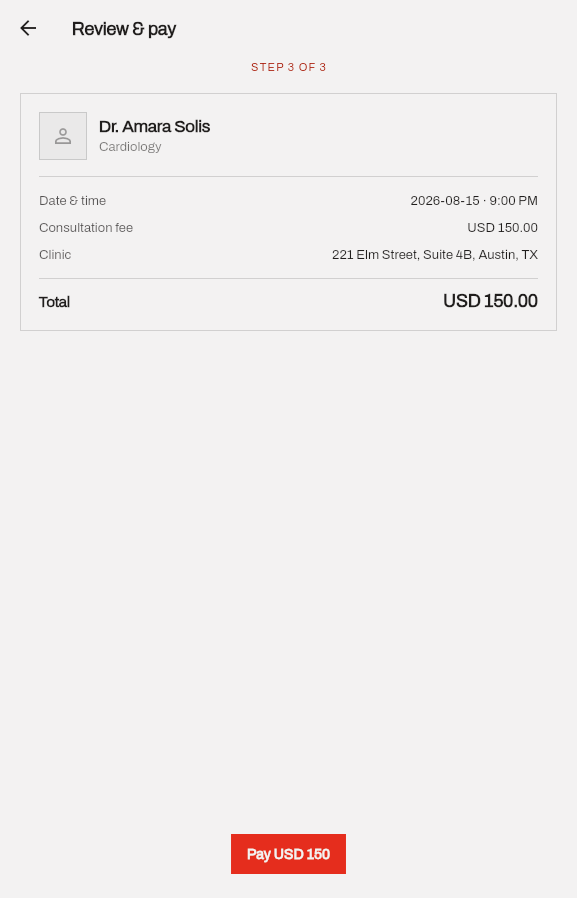
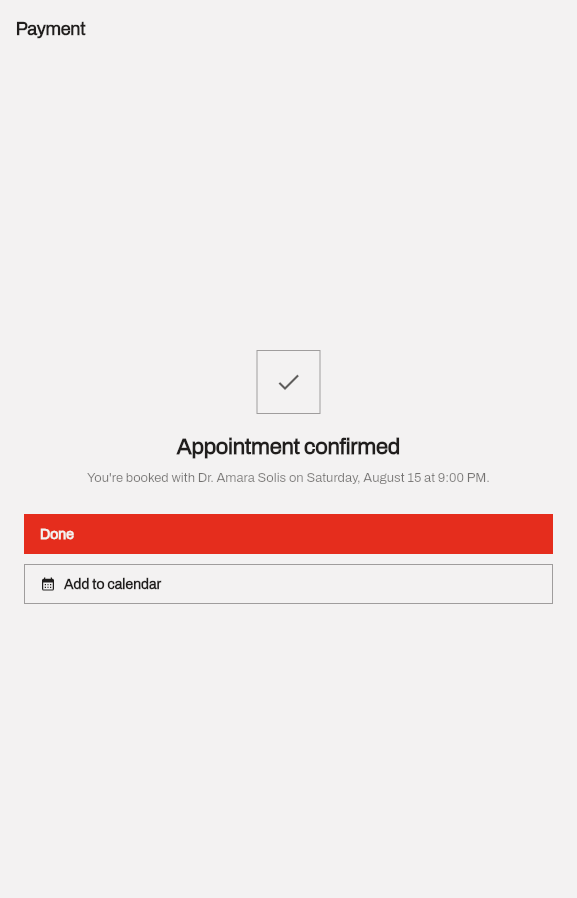
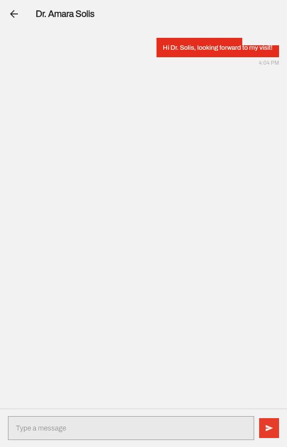

# Asnan — Medical Appointment Platform

**Book a doctor, pay, and message them before your visit — a full-stack telemedicine appointment platform built from scratch: Flutter (Android/iOS) + ASP.NET Core, with real-time chat, push notifications, and concurrency-safe booking.**

[](https://github.com/wajidalii/asnan-medical-app/actions/workflows/backend-ci.yml)
[](https://github.com/wajidalii/asnan-medical-app/actions/workflows/mobile-ci.yml)
[](LICENSE)
[](mobile)
[](backend)
[](#contributing)

If this is useful or interesting to you, **consider starring the repo** — it helps others find it.

---

## Screenshots

<table>
  <tr>
    <td></td>
    <td></td>
    <td></td>
    <td></td>
  </tr>
  <tr>
    <td align="center">Login</td>
    <td align="center">Doctor search</td>
    <td align="center">Doctor profile</td>
    <td align="center">Pick a slot</td>
  </tr>
  <tr>
    <td></td>
    <td></td>
    <td></td>
    <td></td>
  </tr>
  <tr>
    <td align="center">Slot held (live countdown)</td>
    <td align="center">Review & pay</td>
    <td align="center">Confirmed</td>
    <td align="center">In-appointment chat</td>
  </tr>
</table>

## What it does

- **Find & book a doctor** — search/filter/sort a doctor directory, see live availability, and hold a slot while you pay.
- **No double-booking, ever** — slot holds are enforced by a real database unique constraint, not just application logic, so two patients racing for the same slot can't both win it.
- **Real payment lifecycle** — checkout → provider webhook → server-verified confirmation. The client never marks an appointment as paid on its own say-so.
- **In-appointment chat** — SignalR-powered, real-time, scoped to exactly the patient and doctor on that appointment, with offline queuing and read receipts.
- **Push notifications & deep links** — appointment reminders and chat messages land you directly on the right screen.
- **Calendar integration**, **device/session management**, **rotating refresh tokens**, **rate limiting**, **audit logging** — the operational stuff a real healthcare app needs, not just the happy path.

## Tech stack

| | |
|---|---|
| **Mobile** | Flutter, Riverpod, go_router, Dio, SignalR client, Firebase Cloud Messaging, flutter_secure_storage |
| **Backend** | ASP.NET Core 8 (modular monolith: Api / Application / Domain / Infrastructure), EF Core, MySQL 8, SignalR |
| **Infra** | Docker Compose (MySQL, Redis, nginx), GitHub Actions CI/CD |
| **Design** | A from-scratch flat/mono-accent design system (light + dark), hand-built — see [`mobile/lib/core/theme`](mobile/lib/core/theme) |

Full write-up of every design decision (why rotating refresh tokens, why the slot hold is a DB constraint and not a Redis lock, why SignalR over polling, etc.) is in **[ARCHITECTURE.md](ARCHITECTURE.md)**.

## Getting started

```bash
git clone https://github.com/wajidalii/asnan-medical-app.git
cd asnan-medical-app
cp .env.example .env
./deploy/nginx/generate-dev-cert.sh
docker compose run --rm migrator
docker compose up -d
```

That brings up MySQL, Redis, the API (behind nginx with local HTTPS), all with mock providers so nothing needs real payment/SMS/email credentials to run end-to-end. See **[DEPLOYMENT.md](DEPLOYMENT.md)** for the full environment variable reference, and [`backend/README.md`](backend/README.md) / [`mobile/README.md`](mobile/README.md) for running each half directly without Docker.

## Project structure

```text
backend/    ASP.NET Core API — Asnan.Api / Asnan.Application / Asnan.Domain / Asnan.Infrastructure
mobile/     Flutter app — feature-first Clean Architecture (core/ + features/*)
deploy/     nginx config, local dev TLS cert generation
docs/       Screenshots and other repo assets
ARCHITECTURE.md   System design and every non-obvious engineering decision, explained
DEPLOYMENT.md     Environment variables, Docker Compose, CD pipeline
```

## Contributing

Issues and PRs are welcome. Backend changes run through `backend-ci.yml` (build + test against a real MySQL service container); mobile changes run through `mobile-ci.yml` (`flutter analyze` + `flutter test`). Please keep PRs scoped and include tests for behavior changes.

## License

[MIT](LICENSE) — free to use, modify, and build on.
